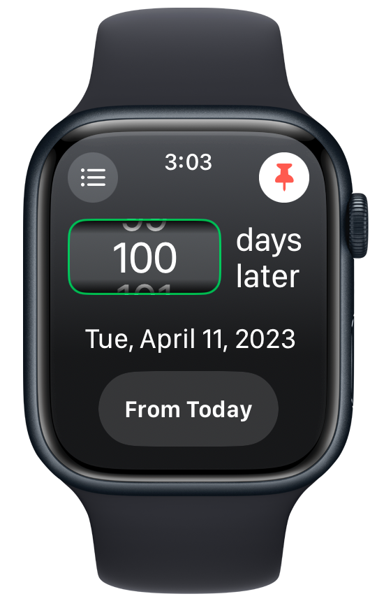
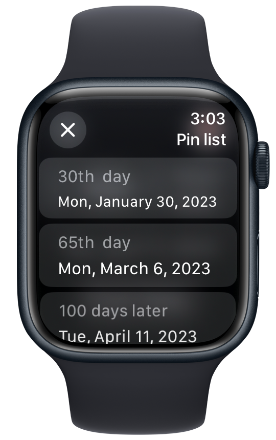
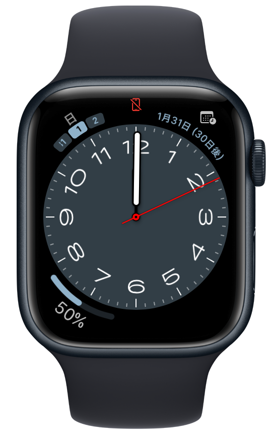

 

<H1 ALIGN="center">
DatePlus for Apple Watch
</H1>

This app is a simple tool for calculating the date after a specified number of days on Apple Watch. 
You can add any number of days from a specific date and view the resulting date.

  <a href="https://apps.apple.com/jp/app/dateplus-%E6%97%A5%E4%BB%98%E8%A8%88%E7%AE%97%E3%82%A2%E3%83%97%E3%83%AA/id6458592460" target="_blank">
  
   
   
  <a href="https://date-plus.root-lump.net/update-history/">Update history [Simplified version]</a> | <a href="https://github.com/root-lump/DatePlus/releases">Change log</a> | <a href="https://date-plus.root-lump.net/privacy-policy/">Privacy policy</a>

## Features

- ➕ [**Add Days**](https://date-plus.root-lump.net) - Add a specified number of days to any date.
- 📌 [**Pin Feature**](https://date-plus.root-lump.net) - Save specific calculations for quick reference later.
- ⌚ [**Complication Display**](https://date-plus.root-lump.net) - View your calculations directly on your watch face.
- 🎨 [**Intuitive UI**](https://date-plus.root-lump.net) - Easy-to-use interface on Apple Watch.
- 📅 [**Calculate from Today**](https://date-plus.root-lump.net) - Automatically use today's date as the starting point for calculations. This feature can be turned on or off.

## Screenshots

## Getting Started

### Download From AppStore 📲

### Init Project Locally 💻

check [Release](https://github.com/root-lump/DatePlus/releases)

#### Environment
- Xcode - Xcode 14.3.1
- macOS - macOS Ventura 13.5

## Contributing
Pull requests and feedback are welcome. Feel free to report bugs or request features through Issues. 
We also have a [support page](https://date-plus.root-lump.net/contact/).

## License

MIT License © 2023 [root-lump](https://github.com/root-lump) 
See the [LICENSE](LICENSE) for details.
