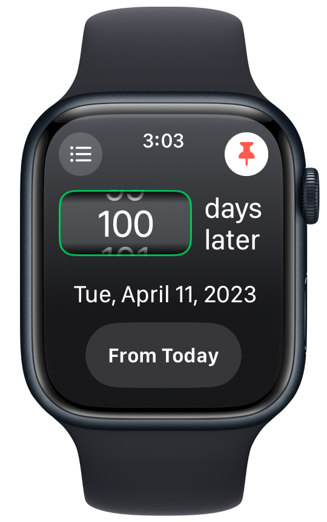
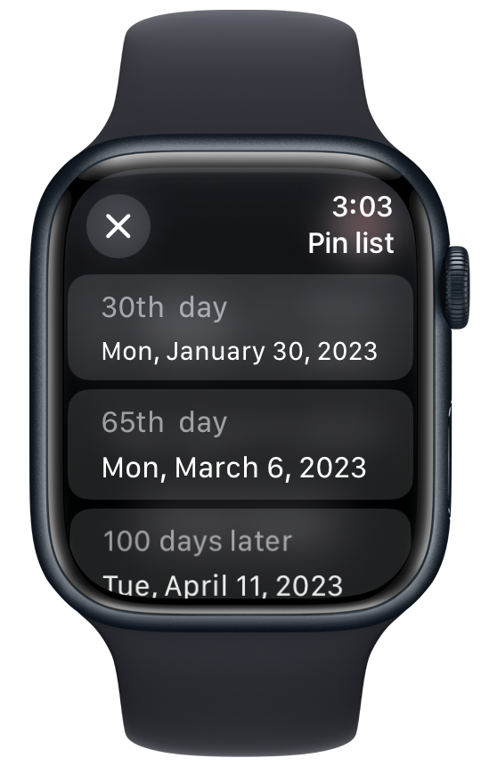
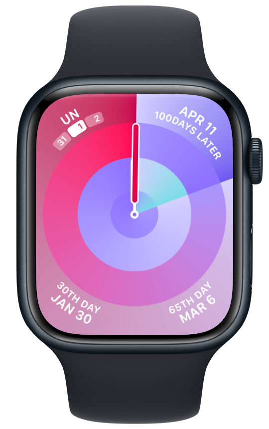

<br>
<p align="center">
<a href="https://date-plus.root-lump.net?lang=en" target="_blank">

</a>
</p>

<H1 ALIGN="center">
DatePlus for Apple Watch
</H1>

<p align="center">
This app is a simple tool for calculating the date after a specified number of days on Apple Watch.<br>
You can add any number of days from a specific date and view the resulting date.
</p>

<p align="center">
<a href="https://github.com/root-lump/DatePlus" target="__blank"></a>
</p>

<p align="center">
  <a href="https://apps.apple.com/jp/app/dateplus-%E6%97%A5%E4%BB%98%E8%A8%88%E7%AE%97%E3%82%A2%E3%83%97%E3%83%AA/id6458592460" target="_blank">
  
  <br>
  <br>
  <a href="https://date-plus.root-lump.net?lang=en#updates">Update history [Simplified version]</a> | <a href="https://github.com/root-lump/DatePlus/releases">Change log</a> | <a href="https://date-plus.root-lump.net/privacy-policy?lang=en">Privacy policy</a>
</p>

## Features

- ➕ [**Add Days**](https://date-plus.root-lump.net?lang=en#screens) - Add a specified number of days to any date.
- 📌 [**Pin Feature**](https://date-plus.root-lump.net?lang=en#screens) - Save specific calculations for quick reference later.
- ⌚ [**Complication Display**](https://date-plus.root-lump.net?lang=en#screens) - View your calculations directly on your watch face.
- 🎨 [**Intuitive UI**](https://date-plus.root-lump.net?lang=en#screens) - Easy-to-use interface on Apple Watch.
- 📁 [**Smart Stack Support**](https://date-plus.root-lump.net?lang=en#screens) - Smart Stack is a feature that displays appropriate information in a timely manner based on the user's situation.
- 📅 [**Calculate from Today**](https://date-plus.root-lump.net?lang=en#screens) - Automatically use today's date as the starting point for calculations. This feature can be turned on or off.

## Screenshots
<p align="center">



</p>

## Getting Started

### Download From AppStore 📲
<p>
  <a href="https://apps.apple.com/jp/app/dateplus-%E6%97%A5%E4%BB%98%E8%A8%88%E7%AE%97%E3%82%A2%E3%83%97%E3%83%AA/id6458592460" target="_blank">
  
  </a>
</p>

### Run the project locally 💻

1. Clone this repository.
2. Open `DatePlus.xcodeproj` in Xcode 16.2 or later.
3. Select the `DatePlus Watch App` scheme and a watchOS simulator.
4. Run the app.

The app keeps watchOS 9 as its minimum deployment target and builds against the
watchOS SDK bundled with the selected Xcode. Shared domain, persistence, and
localization code uses a local Swift Package:

```text
DatePlusWatchApp/
├── App/                 # App entry point and shared state
├── Features/            # Calculator, pinned days, complications
├── Navigation/          # watchOS 9 and watchOS 10 navigation shells
├── Resources/
└── SupportingFiles/
DatePlusWidgetExtension/
├── App/
├── Timeline/
├── Views/
├── Resources/
└── SupportingFiles/
Packages/DatePlusCore/
├── Sources/             # Domain, persistence, String Catalog localization
└── Tests/
Configurations/          # Shared Xcode build settings
```

Run the package tests independently with:

```sh
swift test --package-path Packages/DatePlusCore
```

English and Japanese strings live in
`Packages/DatePlusCore/Sources/DatePlusCore/Resources/Localizable.xcstrings`.
Views inject SwiftUI's current `Locale`, so previews and simulator language
changes use the same standard localization path as production.

## Contributing
Pull requests and feedback are welcome. Feel free to report bugs or request features through Issues.<br>
We also have a [support page](https://date-plus.root-lump.net/contact?lang=en).


## License

MIT License © 2023 [root-lump](https://github.com/root-lump)<br>
See the [LICENSE](LICENSE) for details.
